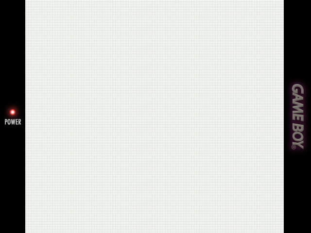
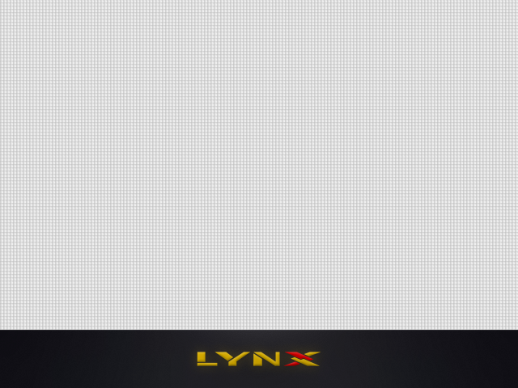
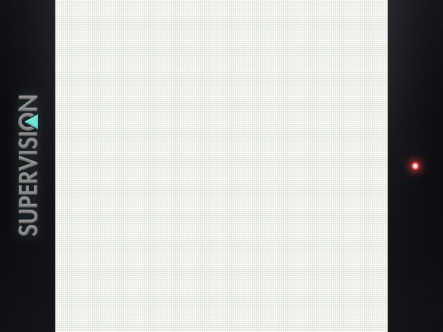
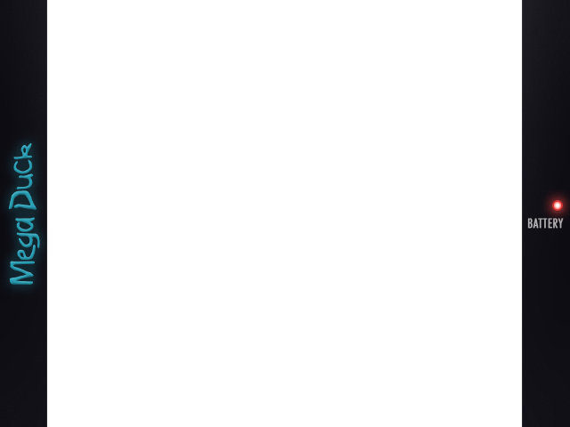
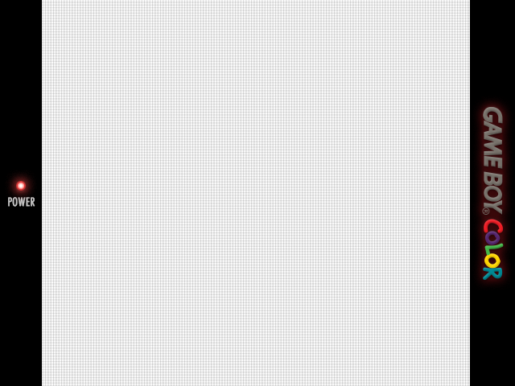
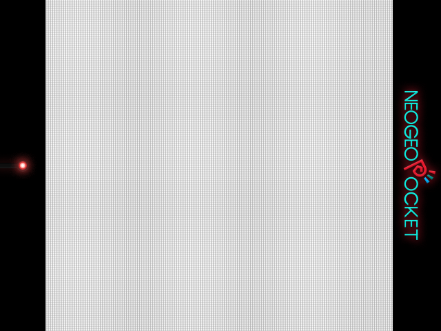
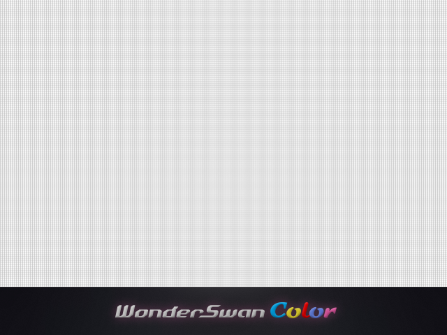
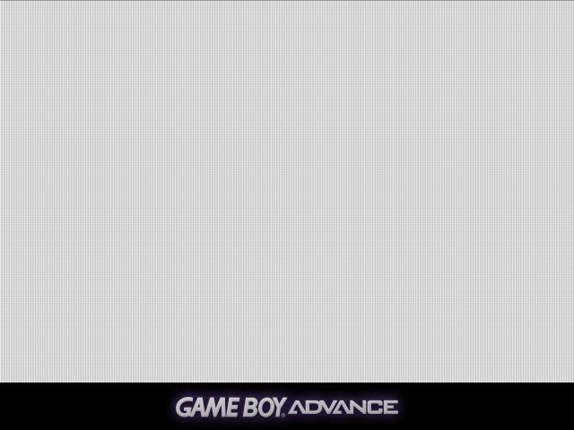
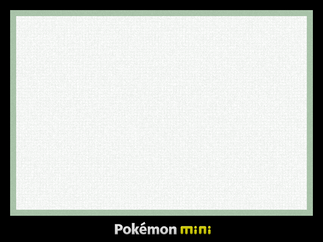
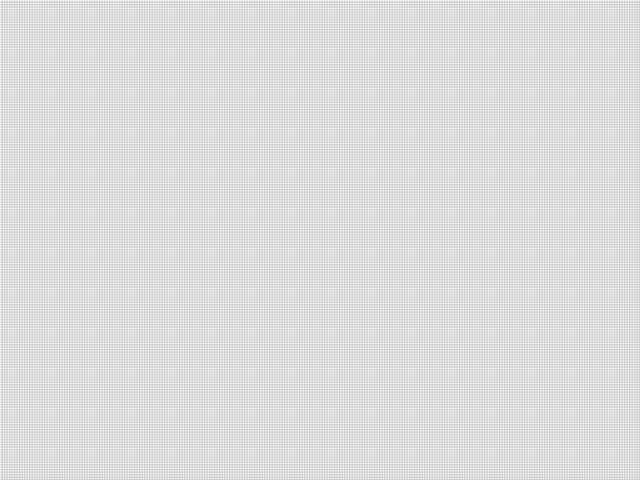

# Subtle Handheld Overlays Collection for Onion OS on Miyoo Mini

This project is not about creating photorealistic overlays for every specific device. The goal is to improve how classic handheld systems look when low pixel-density graphics are upscaled to a 640x480 display, so the image feels less flat and less purely pixel-sharp, and a bit more like playing on a real native screen. It also masks the inherent artifacts of non-integer upscaling.

Color handheld systems use a subtle pixel grid that gently shapes and simulates individual pixels. Monochrome LCD handheld systems use a different grid that simulates the gaps between LCD crystals.

Everything is intentionally subtle to avoid negatively affecting image quality while still adding a nostalgic feeling, as if you were playing on a low-resolution display.

Portrait overlays include decorative bezels on the left and right sides. Landscape overlays shift the rendered image upward with a filter and place the system logo below.

## System Previews and Settings

### Game Boy (GB)

| Preview                                                                       | Settings        |
| ----------------------------------------------------------------------------- | --------------- |
|  | <pre>Quick Menu |

    On-Screen Overlay
    	Display Overlay: On
    	Overlay Preset: Subtle_GB
    	Overlay Opacity: 1.00

Settings
Video
Scaling
Integer Scale: Off
Keep Aspect Ratio: On
Image Interpolation: Bicubic
Video Filter: Subtle_GB</pre> |

### Lynx

| Preview                                                                               | Settings        |
| ------------------------------------------------------------------------------------- | --------------- |
|  | <pre>Quick Menu |

    On-Screen Overlay
    	Display Overlay: On
    	Overlay Preset: Subtle_LYNX
    	Overlay Opacity: 1.00

Settings
Video
Scaling
Integer Scale: Off
Keep Aspect Ratio: On
Image Interpolation: Bicubic
Video Filter: Subtle_LYNX</pre> |

### Game Gear (GG)

| Preview                                                                       | Settings        |
| ----------------------------------------------------------------------------- | --------------- |
|  | <pre>Quick Menu |

    On-Screen Overlay
    	Display Overlay: On
    	Overlay Preset: Subtle_GG
    	Overlay Opacity: 1.00

Settings
Video
Scaling
Integer Scale: Off
Keep Aspect Ratio: On
Image Interpolation: Bicubic
Video Filter: Subtle_GG</pre> |

### Supervision

| Preview                                                                                                           | Settings        |
| ----------------------------------------------------------------------------------------------------------------- | --------------- |
|  | <pre>Quick Menu |

    On-Screen Overlay
    	Display Overlay: On
    	Overlay Preset: Subtle_SUPERVISION
    	Overlay Opacity: 1.00

Settings
Video
Scaling
Integer Scale: Off
Keep Aspect Ratio: On
Image Interpolation: Bicubic
Video Filter: Subtle_SUPERVISION</pre> |

### Mega Duck

| Preview                                                                                               | Settings        |
| ----------------------------------------------------------------------------------------------------- | --------------- |
|  | <pre>Quick Menu |

    On-Screen Overlay
    	Display Overlay: On
    	Overlay Preset: Subtle_MEGADUCK
    	Overlay Opacity: 1.00

Settings
Video
Scaling
Integer Scale: Off
Keep Aspect Ratio: On
Image Interpolation: Bicubic
Video Filter: Subtle_MEGADUCK</pre> |

### Game Boy Color (GBC)

| Preview                                                                           | Settings        |
| --------------------------------------------------------------------------------- | --------------- |
|  | <pre>Quick Menu |

    On-Screen Overlay
    	Display Overlay: On
    	Overlay Preset: Subtle_GBC
    	Overlay Opacity: 1.00

Settings
Video
Scaling
Integer Scale: Off
Keep Aspect Ratio: On
Image Interpolation: Bicubic
Video Filter: Subtle_GBC</pre> |

### Neo Geo Pocket (NGP)

| Preview                                                                           | Settings        |
| --------------------------------------------------------------------------------- | --------------- |
|  | <pre>Quick Menu |

    On-Screen Overlay
    	Display Overlay: On
    	Overlay Preset: Subtle_NGP
    	Overlay Opacity: 1.00

Settings
Video
Scaling
Integer Scale: Off
Keep Aspect Ratio: On
Image Interpolation: Bicubic
Video Filter: Subtle_NGP</pre> |

### WonderSwan (WS)

| Preview                                                                       | Settings        |
| ----------------------------------------------------------------------------- | --------------- |
|  | <pre>Quick Menu |

    On-Screen Overlay
    	Display Overlay: On
    	Overlay Preset: Subtle_WS
    	Overlay Opacity: 1.00

Settings
Video
Scaling
Integer Scale: Off
Keep Aspect Ratio: On
Image Interpolation: Bicubic
Video Filter: Subtle_WS</pre> |

### Game Boy Advance (GBA)

| Preview                                                                           | Settings        |
| --------------------------------------------------------------------------------- | --------------- |
|  | <pre>Quick Menu |

    On-Screen Overlay
    	Display Overlay: On
    	Overlay Preset: Subtle_GBA
    	Overlay Opacity: 1.00

Settings
Video
Scaling
Integer Scale: Off
Keep Aspect Ratio: On
Image Interpolation: Bicubic
Video Filter: Subtle_GBA</pre> |

### Pokemon Mini (POKE)

| Preview                                                                               | Settings        |
| ------------------------------------------------------------------------------------- | --------------- |
|  | <pre>Quick Menu |

    On-Screen Overlay
    	Display Overlay: On
    	Overlay Preset: Subtle_POKE
    	Overlay Opacity: 1.00

Settings
Video
Scaling
Integer Scale: Off
Keep Aspect Ratio: On
Image Interpolation: Bicubic
Video Filter: Subtle_POKE</pre> |

### Nintendo DS (NDS)

| Preview                                                         | Settings        |
| --------------------------------------------------------------- | --------------- |
|  | <pre>Quick Menu |

    On-Screen Overlay
    	Display Overlay: On
    	Overlay Preset: Subtle_NDS
    	Overlay Opacity: 1.00

Settings
Video
Scaling
Integer Scale: Off
Keep Aspect Ratio: On
Image Interpolation: Bicubic
Video Filter: Subtle_NDS</pre> |

### Apotris (GBA)

| Preview                                                                                       | Settings        |
| --------------------------------------------------------------------------------------------- | --------------- |
|  | <pre>Quick Menu |

    On-Screen Overlay
    	Display Overlay: On
    	Overlay Preset: Subtle_Apotris
    	Overlay Opacity: 1.00

Settings
Video
Scaling
Integer Scale: Off
Keep Aspect Ratio: On
Image Interpolation: Bicubic
Video Filter: Subtle_Apotris</pre> |
